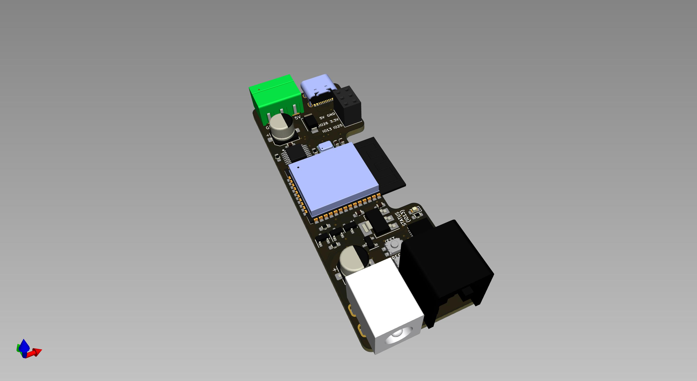
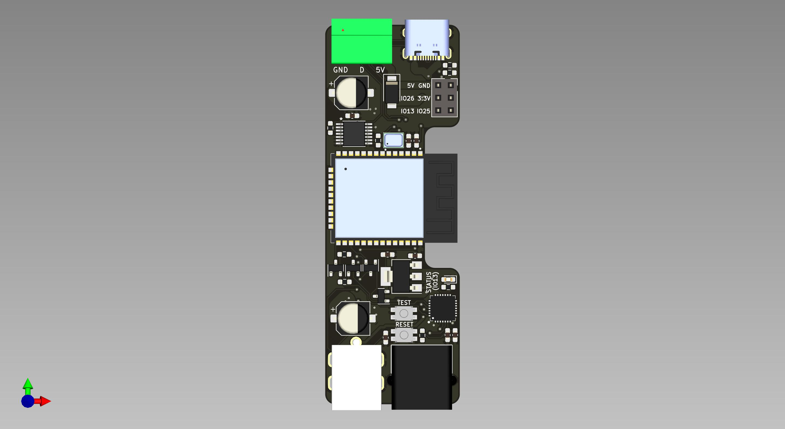
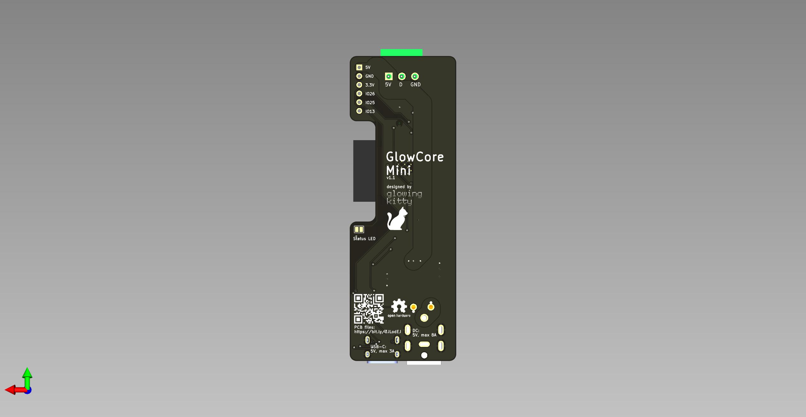

# GlowCoreMini

## Warning:

This project is currently under active development and has not been fully tested yet. If you decide to build or clone the project, be aware the project might not work yet as expected. Use at your own risk.

## What is this project?

A small PCB for controlling one LED strip. Program the integrated ESP32, and power everything via USB-C or DC power.

## Links

- [Schematic](https://github.com/glowingkitty/GlowCoreMini/blob/main/GlowCoreMini.pdf)
- [Interactive BOM](https://htmlpreview.github.io/?https://github.com/glowingkitty/GlowCoreMini/blob/main/bom/ibom.html)
- [PCB stencils](https://github.com/glowingkitty/GlowCoreMini/blob/main/PCB%20stencils)